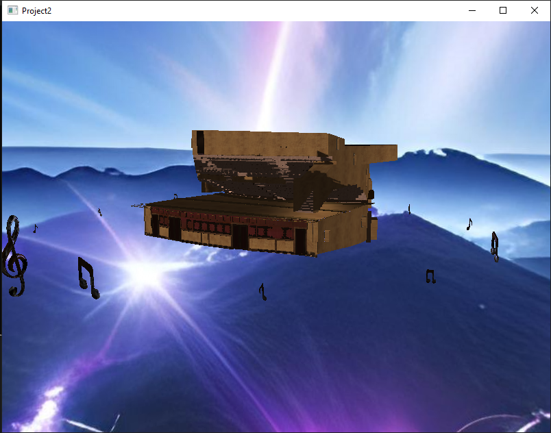
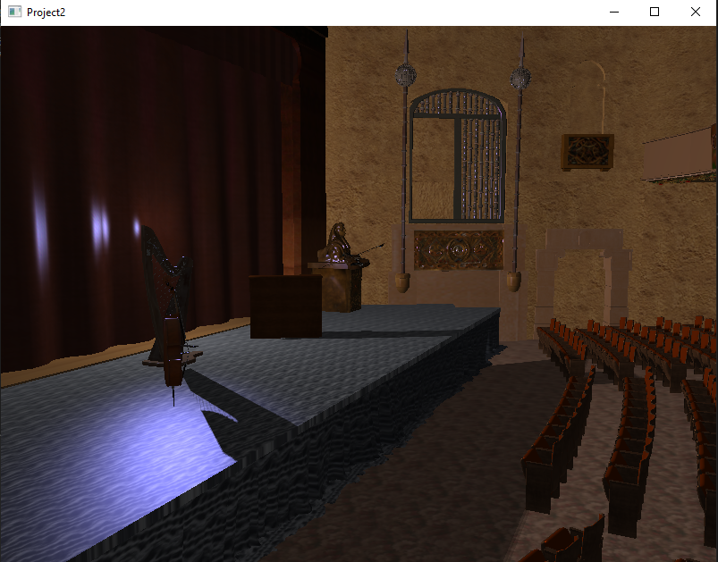

# **OpenGL 3D Project with GLTF Models, Skybox, and Sound Integration**

## **Overview**
This project is a 3D rendering application built using OpenGL. It features:
- **GLTF model loading** using `tinygltf`
- **Camera control**
- **Skybox rendering**
- **Shadow mapping** for realistic lighting
- **Sound playback** using `miniaudio`
- **Real-time transformations and animations**

## **Features**
- Load and render multiple `.glb` models.
- Real-time camera movement and rotation using mouse and keyboard inputs.
- Dynamic lighting and shadow mapping.
- Skybox integration for environmental effects.
- sound support

## **Screenshots**


     


     

---

## **Controls**
- **W / A / S / D**: Move the camera
- **Mouse Movement**: Rotate the camera
- **ESC**: Exit the application

---

## **Installation and Usage**
1. Clone the repository:
   ```bash
   git clone https://github.com/your-username/your-repo-name.git


2. Build the project using Visual Studio or your preferred IDE.
3. Run the executable.
